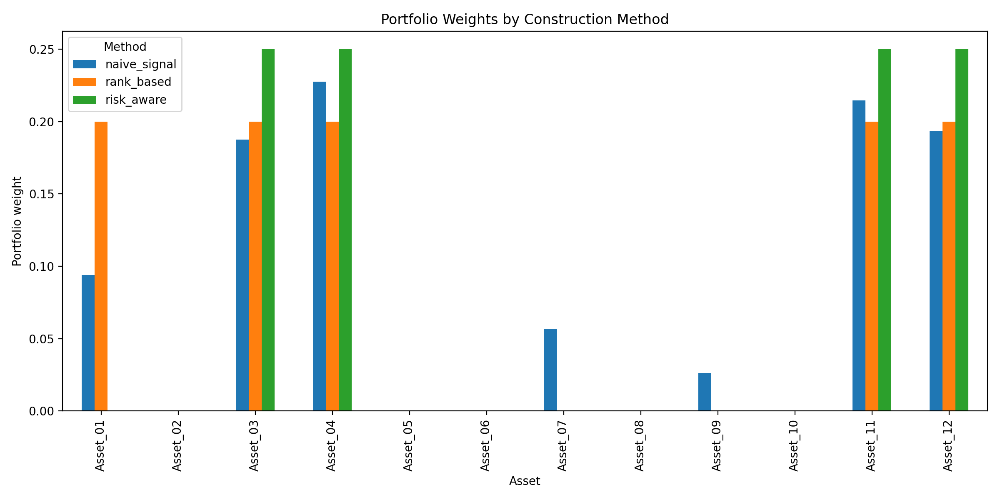
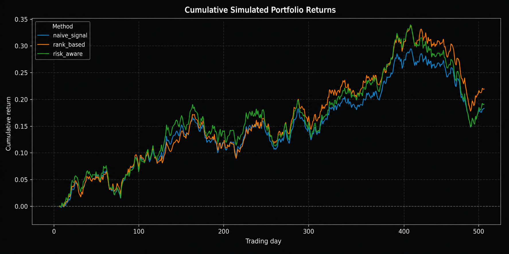
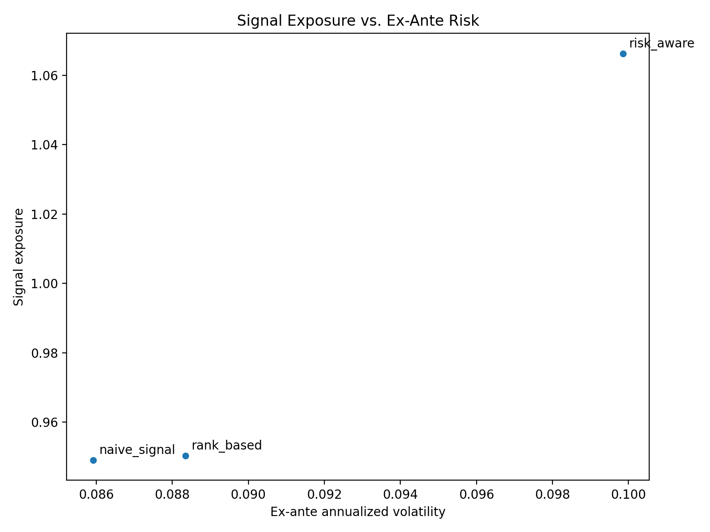

# Signal-to-Portfolio: A Risk-Aware Portfolio Construction Framework

**Signal-to-Portfolio** is a compact quantitative finance project that demonstrates how raw alpha scores can be translated into portfolio weights.

The central idea is simple:

> A signal is not a portfolio.

A signal can rank assets by attractiveness, but it does not directly answer the allocation question: how much capital should be assigned to each asset once risk, covariance, and concentration are taken into account?

This repository compares three portfolio construction methods and evaluates their behavior on synthetic market data.

## Project Scope

This project focuses on the **portfolio construction layer** of a quantitative investment workflow:

1. Simulate asset returns and alpha scores
2. Convert alpha scores into portfolio weights
3. Compare naive, rank-based, and risk-aware allocation methods
4. Evaluate signal exposure, ex-ante risk, concentration, and simulated performance
5. Export figures, metrics, and a short summary report

The data is synthetic by design. The objective is not to claim a live trading edge, but to build a clean and transparent research pipeline from signal to allocation.

## Portfolio Construction Methods

### 1. Naive Signal Weighting

Positive alpha scores are converted directly into proportional long-only weights.

### 2. Rank-Based Weighting

The top-ranked assets are selected and equally weighted.

### 3. Risk-Aware Optimization

Portfolio weights are chosen by maximizing signal exposure while penalizing covariance risk:

```math
\max_w \quad s^\top w - \lambda w^\top \Sigma w
```

subject to:

```math
\sum_i w_i = 1, \quad 0 \leq w_i \leq w_{max}
```

where:

- `s` is the alpha score vector
- `w` is the portfolio weight vector
- `Σ` is the covariance matrix of returns
- `λ` controls the strength of the risk penalty
- `w_max` is a maximum single-position weight constraint

## Example Outputs

Running the project creates portfolio weights, diagnostics, cumulative simulated returns, and a short report.

### Portfolio Weights



### Cumulative Simulated Returns



### Signal-Risk Trade-Off



## Repository Structure

```text
signal-to-portfolio/
├── README.md
├── requirements.txt
├── pyproject.toml
├── run_analysis.py
├── src/
│   ├── simulate_data.py
│   ├── optimize.py
│   ├── evaluate.py
│   └── plots.py
├── notebooks/
│   └── signal_to_portfolio.ipynb
├── notes/
│   ├── mathematical_derivation.md
│   └── beyond_correlation_treatment_effects.md
├── figures/
│   ├── portfolio_weights.png
│   ├── cumulative_returns.png
│   └── portfolio_diagnostics.png
├── data/
│   ├── alpha_scores.csv
│   ├── portfolio_weights.csv
│   ├── portfolio_metrics.csv
│   ├── cumulative_returns.csv
│   └── simulated_returns.csv
├── reports/
│   └── portfolio_summary.md
└── tests/
    └── test_portfolio_construction.py
```

## Quick Start

Clone the repository and install the dependencies:

```bash
pip install -r requirements.txt
```

Run the full analysis:

```bash
python run_analysis.py
```

This creates updated files in:

- `figures/`
- `data/`
- `reports/`

## Notebook

A notebook version of the workflow is available here:

[`notebooks/signal_to_portfolio.ipynb`](notebooks/signal_to_portfolio.ipynb)

## Research Extension: Beyond Correlation

This project assumes that the alpha score contains useful information. A deeper research question comes before portfolio construction:

> Does the observed return pattern reflect a robust market effect, or is it only correlation?

The notes folder sketches how treatment-effect thinking and causal inference can extend simple signal testing into a more disciplined empirical research framework.

See: [`notes/beyond_correlation_treatment_effects.md`](notes/beyond_correlation_treatment_effects.md)

## Limitations

- The data is synthetic and not a live trading dataset.
- Transaction costs, turnover, liquidity, and factor exposure constraints are not yet included.
- The risk-aware optimizer is intentionally simple and designed for clarity.
- Results should be interpreted as a portfolio-construction demonstration, not investment advice.

## Next Steps

Potential extensions:

- Add transaction costs and turnover analysis
- Add long-short portfolio construction
- Add factor-neutral or sector-neutral constraints
- Replace synthetic data with a real public dataset
- Add rolling rebalancing and out-of-sample evaluation
- Extend the research layer using causal inference and treatment-effect methods
